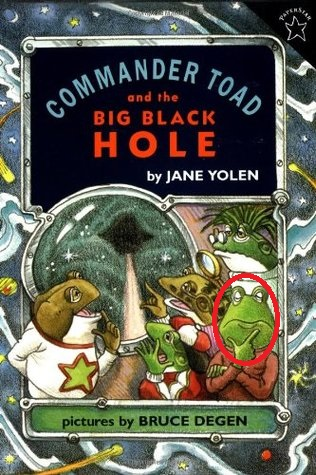

## Why S4?
* Object oriented programming is supposed to be a good thing
* S4 seems to be the most widely used OOP system in R today
* Bioconductor project recommends using S4

```{r code output options, echo = FALSE}
knitr::opts_chunk$set(collapse = TRUE, comment = "#>")
```

## A simple class
Set up a class
```{r Scifi_Character class}
setClass("Scifi_Character", 
         slots = list(name = "character",
                      description = "character",
                      starship = "character",
                      action = "character",
                      likability = "numeric")
         )
```

## Create an object
```{r Mr. Hop}
mr_hop <- new("Scifi_Character",
             name = "Mr. Hop", 
             description = "sapient frog", 
             starship = "Star Warts",
             action = "thinks deep thoughts behind his green face",
             likability = 10)
```

## Mr Hop


## Generics and methods
* S4 system quirk: methods are called from __generic functions__
* Motivation: make the "same" function do different things depending on the classes of its arguments
* For example, functions like _print_ or _plot_ can output different things depending on what kind of object they are applied to
* If a class-specific method is not defined, generic may still work
* Every method must have a generic

## Print mr_hop using generic print function
```{r print Mr. Hop}
print(mr_hop)
```

## Define print method for class Scifi_Character
```{r Define print method for class Scifi_Character}
setMethod("print", signature(x = "Scifi_Character"),
          function(x) {
            cat(x@name, "is a", x@description, "who travels aboard the",
                x@starship, "and", x@action)
          }
          )
```

## Print Mr. Hop using our custom print method
```{r Print Mr. Hop using our custom print method, results='asis'}
print(mr_hop)
```

## A method's signature must specify classes of generic's arguments
Generic: ```print(x, ...)```   
Method: 
```
setMethod("print", signature(x = "Scifi_Character"), 
          function(x){...}
         )
```

Generic: ```plot(x, y, ...)```   
Method:
```
setMethod("plot",
          signature(x = "DRE", y="missing"),
          function (x, y, ...){...}
         )
```

## Define name accessors for Scifi_Character
```{r Define name accessors for Scifi_Character, results='hide'}
# Getter
setGeneric("name", function(object) standardGeneric("name"))

setMethod("name", "Scifi_Character", function(object) object@name)

# Setter
setGeneric("name<-", function(object, value) standardGeneric("name<-"))

setReplaceMethod("name", "Scifi_Character", 
                 function(object, value){ 
                   object@name <- value
                   object
                 }
)
```

## Use name accessors
```{r Use name accessors}
name(mr_hop)
name(mr_hop) <- "Mr. Spock"
name(mr_hop)
```

## Why do I need to write accessors?
Code iteration        |No accessor                    |Use accessor
----------------------|------------------------------ |----------------------
1. Store age in a slot|`person@age`                   |`age(person)`
2. Store DOB instead  |Replace `person@age` everywhere|Edit `age` method only

## But writing accessors is BORING!
```{r But writing accessors is BORING!}
distr::standardMethods("Scifi_Character")
```

## Inheritance
```{r Inheritance}
setClass("Robot", contains = "Scifi_Character",
         slots = list(designer = "character")
)
```
## Commander Data
```{r Commander Data}
cmdr_data <- new("Robot",
                 name = "Commander Data", 
                 description = "sentient android", 
                 starship = "Enterprize",
                 action = "wonders if there's anything to write home about",
                 likability = 10,
                 designer = "Doctor Noonien Soong")
```

## Print Commander Data
```{r Print Commander Data using our custom print method, results='asis'}
print(cmdr_data)
```

